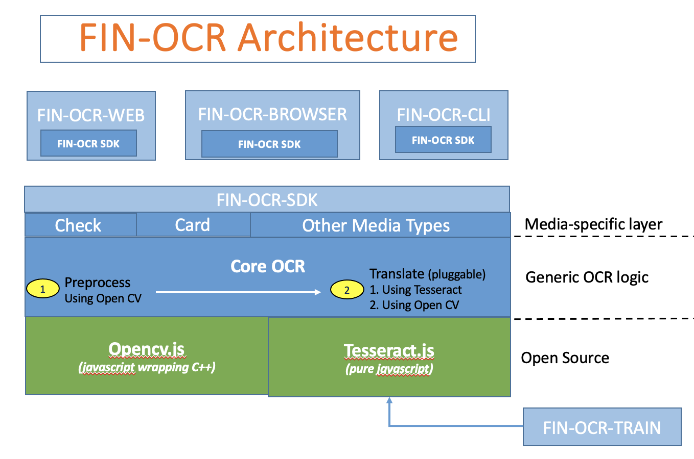

# FIN-OCR Architecture

The following diagram depicts the overall architecture of the FIN-OCR project.

* FIN-OCR-WEB

  A web-based microservice which provides a REST-ful API for OCR functionality. This microservice is useful for performing OCR in an enterprise's check inclearing workflow when the main processing is performed by a language other than javascript or typescript.
  
  See the [README](https://github.com/discoverfinancial/fin-ocr-rest?tab=readme-ov-file#fin-ocr-rest) for more information.

* FIN-OCR-BROWSER

  A browser-based demo application which uses your webcam to capture check images and translate the MICR line.  This uses the OCR SDK to to perform the actual OCR processing.
  
  See the [README](https://github.com/discoverfinancial/fin-ocr-browser?tab=readme-ov-file#fin-ocr-browser-based-demo-application) for more information.

* FIN-OCR-CLI

  The `ocr` command line interface tool is used for testing and training for this project.
  
  See the [README](https://github.com/discoverfinancial/fin-ocr-cli?tab=readme-ov-file#fin-ocr-cli) for more information.

* FIN-OCR-SDK

  The [OCR SDK](https://github.com/discoverfinancial/fin-ocr-sdk?tab=readme-ov-file#fin-ocr-sdk) is the processing engine.

  It contains a media-specific layer at the top, providing ease-to-use for specific use cases.  Currently only bank checks are supported, but credit cards or other may be supported in the future at this layer.

  The majority of the SDK is part of the `Core OCR` component.  At a high-level, it performs the following steps:

  1. preprocess
     
     This step uses opencv to perform various image processing operations such as noise reduction, skew correction, and locating and cropping the MICR line.  The goal is to pass as clean an image as possible to step 2, the translation phase.
     
  2. translate
  
     The goal of the translation phase is to convert the preprocessed image to text as accurately as possible.
     The architecture allows for multiple pluggable translators.  There are currently two translators and both run by default:

     1. tesseract translator
     
        Generally speaking, tesseract may or may not require special training, depending upon the symbols that need to be processed and whether or not public training data for your symbols of interest already exist and are accurate enough.  For the MICR symbols required for check processing, there is public training data available [here](https://github.com/BigPino67/Tesseract-MICR-OCR/blob/master/Tessdata/mcr.traineddata); however, this has not proven accurate enough.  Therefore, see [the training repository](https://github.com/discoverfinancial/fin-ocr-train) for instructions on how we trained tesseract along with the current training data.

     2. opencv-based translator

        This is a translator that we built using OpenCV primitives, most importantly the [OpenCV matchTemplate API](https://docs.opencv.org/3.4/d8/dd1/tutorial_js_template_matching.html).  This translator has an important attribute in that it is possible to add new character images at runtime and therefore dynamically learn immediately.  This is not possible with the tesseract translator which is based on a neural network in which the weights associated with the neural network nodes are modified more slowly and the training and learning is a build-time activity rather than a run-time activity.

  3. parse

     Each translator in the previous step returns a single string which requires special parsing in order to extract seperate field values and return a JSON formatted object.  This logic occurs at the "Media-specific layer" of the SDK and is the simplest part of this three step process.

* FIN-OCR-TRAIN

  The [training repository](https://github.com/discoverfinancial/fin-ocr-train) contains the tooling which was used to train tesseract.  It provides tooling for training based both on real and synthethic data. 
  
  > NOTE: Training is a development or build time activity.  It produces a tesseract *traineddata* file that is bundled with the SDK.  Training tesseract does not currently happen at runtime; however, runtime training would be a potential area for research.

